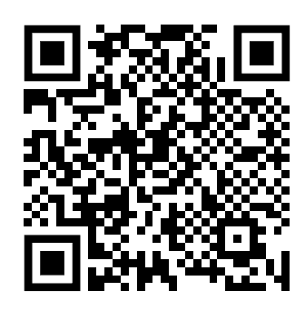
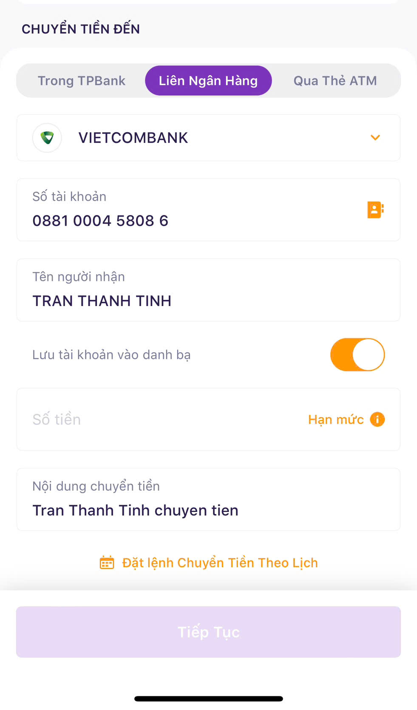
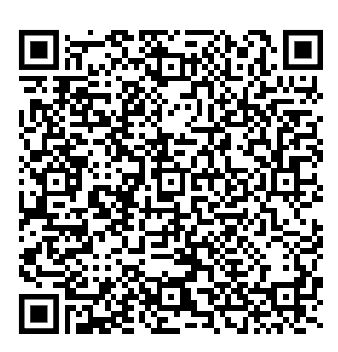
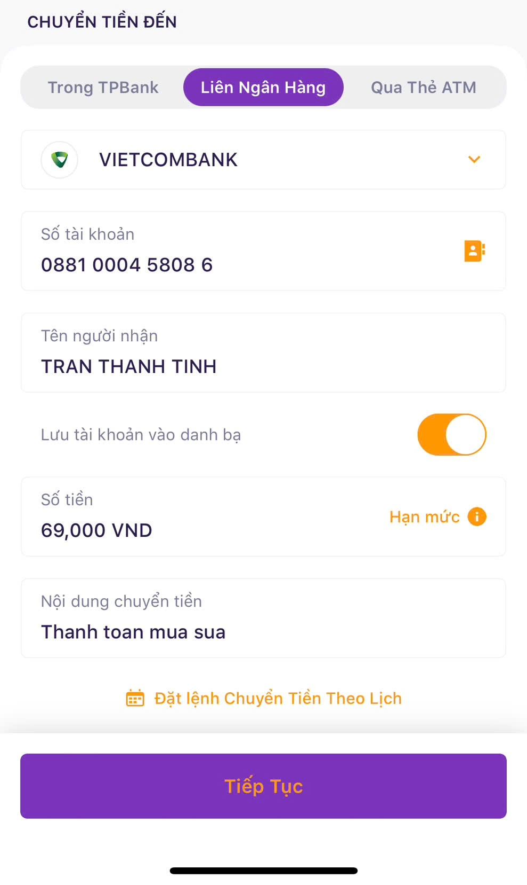

# QRPay EMVCo for VietQR
A Golang package to help build and parse EMVCo VietQR easier with few lines only. This package was based on format of Napas about [VietQR](https://vietqr.net/portal-service/download/documents/QR_Format_T&C_v1.0_VN_092021.pdf) which called **EMVCo** to build QR Code at VietNam. Bank applications will follow this standard to parse info of EMVCo QR and fill in all necessary information to IBFT transfer to account.

Beside that, this package also supports build some more complex use cases of QR such as Visa, Master, UPI, build QR with amount, description, tip and fee as well, ...etc

## Examples for build basic QR Code
Build QR with some basic information like beneficiary account, bank name
```go
basicQRPay := qrpay.BuildQRPay(constants.Bin_VCB, "0881000458086")
	qr, err := basicQRPay.GenerateQRCode()
	if err != nil {
		fmt.Println("generate qr code failed", err)
		os.Exit(1)
	}

	fmt.Printf("QR Code: %s\n", qr)

	qrPay, err := qrpay.ParseQRPay(qr)
	if err != nil {
		fmt.Printf("parse VietQR ERROR: %v\n", err)
		os.Exit(1)
	}

	fmt.Printf("Amount: %v\n", qrPay.Amount)
	data, _ := json.Marshal(qrPay)
	fmt.Println(string(data))

  // Print out
  /**
    QR Code: 00020001021238570010A00000072701270006970436011308810004580860208QRIBFTTA53037045802VN6304CD60
    Amount: 0
    {"Version":"00","initiation_method":"12","merchant_info":{"name":"","city":"","country_code":"VN","postal_code":"","napas_provider":{"id":"A000000727","bank_bin":"970436","transfer_to":"0881000458086","method":"QRIBFTTA"},"master_account":"","visa_account":"","jcb_account":"","upi_account":"","category_code":""},"currency_code":"704","amount":0,"tip_and_fee_type":"","tip_and_fee_amount":0,"tip_and_fee_percent":0,"description":"","addition_data":{}}
   **/
```

Please using this tool https://vi.qr-code-generator.com/ and paste the QR code to generating. We will have the QR as below which accepted by all VietNam bank applications that allow users input amont of money and make the transfer complete.



The IBFT transfer screen of TPBank when scanning above QR Code:



## Example for build more complex QR
### Complex QR Example

With more information like amount, currency code, description, tip and fee, merchant category code, merchant city, postal code, ...etc we can using code as below:

```go
	complexQRPay := qrpay.BuildQRPay(
		constants.Bin_VCB,
		"0881000458086",
		qrpay.WithAmount(69000),
		qrpay.WithCurrencyCode(fmt.Sprintf("%d", countries.Singapore.Currency())),
		qrpay.WithDescription("Thanh toán mua sữa"),
		qrpay.WithTipAndFeeType(models.PredefinedTip),
		qrpay.WithTipAndFeeAmount(1000),
		qrpay.WithMerchantInfo(
			qrpay.BuildMerchantInfo(
				"Cửa hàng sữa Vinamilk",
				qrpay.WithCategoryCode(constants.GroceryStoresSupermarkets),
				qrpay.WithMerchantCity("Hồ Chí Minh"),
				qrpay.WithMerchantPostalCode("70000"),
			),
		),
	)

	qr, err = complexQRPay.GenerateQRCode()
	if err != nil {
		fmt.Printf("Error generating QR %v\n", err)
		os.Exit(1)
	}

	fmt.Printf("ComplexQR: %s\n", qr)

	qrPay, err = qrpay.ParseQRPay(qr)
	if err != nil {
		fmt.Printf("parse VietQR ERROR: %v\n", err)
		os.Exit(1)
	}

  // Will print out
  /**
    ComplexQR: 00020001021138570010A00000072701270006970436011308810004580860208QRIBFTTA520454115303702540569000550202560410005802VN5921Cua hang sua Vinamilk6011Ho Chi Minh61057000062220818Thanh toan mua sua63043611
    Amount: 69000
    {"Version":"00","initiation_method":"11","merchant_info":{"name":"Cua hang sua Vinamilk","city":"Ho Chi Minh","country_code":"VN","postal_code":"70000","napas_provider":{"id":"A000000727","bank_bin":"970436","transfer_to":"0881000458086","method":"QRIBFTTA"},"master_account":"","visa_account":"","jcb_account":"","upi_account":"","category_code":"5411"},"currency_code":"702","amount":69000,"tip_and_fee_type":"02","tip_and_fee_amount":1000,"tip_and_fee_percent":0,"description":"","addition_data":{}}
  **/
```



When scaning with bank application, note that also we set currency code as SGD but whether the bank application will respect that or not will depend on its decision.



## VietQR Structure
### QRPay structure

### Napas standard
EMVCo standard works with [**Tag length value**](https://en.wikipedia.org/wiki/Type%E2%80%93length%E2%80%93value) pattern, example a tag with `000200` will have structure as:
- TagID: 00
- TagLength: 02
- TagValue: 00 => has exactly length = 2

#### Tag Information:
Some specific acronyms are available:

- *Format*: N - Number, S - String

- *Display*: M - Mandatory, C - Conditional, O - Optional

| Name | Tag ID | Max Length | Display | Description
| -------------- | -------------- | ------------- | ------------ | ------------
| Payload Format Indicator | 00 | 02 | M | Version of EMVCoQR, default 00
| Point of Initiation Method | 01 | 02 | M | Method of EMVCoQR, Dynamic "12", Static "11"
| Merchant Account Information | 38 | 99 | O | VietQR Tag, contains beneficiary information as account number, bank bin, receiver channel such as QRIBFTTA: QR IBFT via Transfer to Account, QRIBFTTC: QR IBFT via Transfer to Card
| Merchant Category Code | 52 | 04 | O | example travel & tour: "4722", based on Napas providing
| Transaction Currency | 53 | 03 | O | Based on https://en.wikipedia.org/wiki/ISO_4217, example VietNam: "704"
| Transaction Amount | 54 | 13 | C | Amount to be transferred
| Tip or Convenience Indicator | 55 | 25 | O | Tip type: user input or predefined with next tag 56, 57
| Value of Convenience Fee Fixed | 56 | 25 | C | Tip amount will be surcharged
| Value of Convenience Fee Percentage | 57 | 25 | C | Tip amount will be surcharged, calculated based on percentage of amount
| Country Code | 58 | 02 | M | Reference to: https://developer.mastercard.com/card-issuance/documentation/code-and-formats/iso-country-and-currency-codes/
| Merchant Name | 59 | 25 | O | Merchant Name
| Merchant City | 60 | 15 | O | Merchant City
| Postal Code | 61 | 10 | O | Postal Code
| Additional Data Field Template | 62 | 99 | C | Contains information such as description, bill number, store number, loyalty number, etc
| CRC | 63 | 04 | M | Check sum for QR, make sure not be modified

Please reference to Napas docs on the begin of this documentation for more tag like RFU, Unreversed, etc.

**Notes:** thanks for package https://github.com/biter777/countries we have enough information about Currency and Country Code.

### Go structure

```go

// ..another struct

type NapasProvider struct {
	Id         string      `json:"id"`
	BankBin    string      `json:"bank_bin"`
	TransferTo string      `json:"transfer_to"`
	Method     NapasMethod `json:"method"`
}

type MerchantInfo struct {
	Name          string                         `json:"name" valid:"required,maxstringlength(25)"`
	City          string                         `json:"city"`
	CountryCode   string                         `json:"country_code"` // Reference to: https://developer.mastercard.com/card-issuance/documentation/code-and-formats/iso-country-and-currency-codes/
	PostalCode    string                         `json:"postal_code"`  // Zip code
	NapasProvider *NapasProvider                 `json:"napas_provider"`
	MasterAccount string                         `json:"master_account"`
	VisaAccount   string                         `json:"visa_account"`
	JcbAccount    string                         `json:"jcb_account"`
	UpiAccount    string                         `json:"upi_account"`
	CategoryCode  constants.MerchantCategoryCode `json:"category_code"`
}

type QRPay struct {
	// Version of the QR
	Version string

	// Method of QR, fill Dynamic if has amount greater than zero, otherwise fill Static
	InitiationMethod models.InitiationMethod `json:"initiation_method"`

	// Merchant Info to fill in, such as bank bin acquirer, beneficiary number, etc
	MerchantInfo *models.MerchantInfo `json:"merchant_info"`

	// Currency code of QR, refenrece to https://en.wikipedia.org/wiki/ISO_4217
	CurrencyCode string `json:"currency_code"`

	// Amount of money which will be transferred
	Amount int64 `json:"amount"`

	// Tip and fee type of QR
	TipAndFeeType models.TipAndFeeType `json:"tip_and_fee_type"`

	// Tip and Fee type was defined, tip and fee amount will be take first if both amount and percentage are provided
	TipAndFeeAmount int64 `json:"tip_and_fee_amount"`

	// Percent of amount will be tip
	TipAndFeePercent int `json:"tip_and_fee_percent"`

	// Description when transferring
	Description string `json:"description"`

	// This field will be overwritten when build QR, so don't initialize it when building QR
	AdditionData map[models.AdditionDataType]string `json:"addition_data"`
}
```

## Summary
We already support UPI, Visa, Master so please reference to `models.MerchantInfo` for more details, fill in data and process to build QR. Any further concerns, please create a MR.
